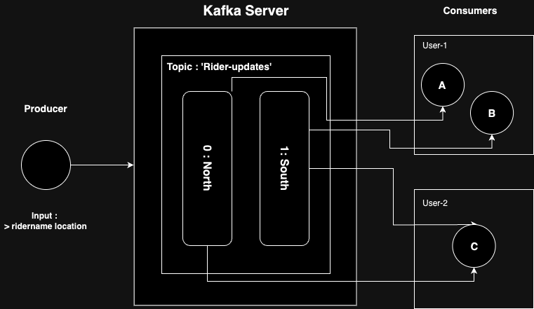
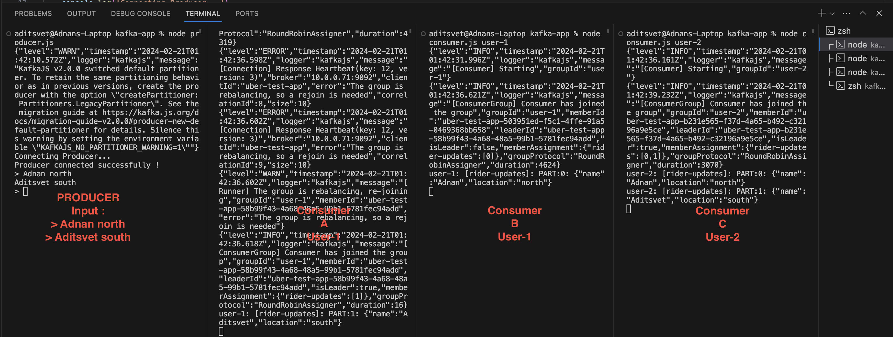

# kafka-crash-course

The Kafka-based Rider Location Tracking System is a real-time application designed to track the locations of riders in a distributed environment using Apache Kafka as the messaging system. The system consists of four main components: `client.js`, `admin.js`, `producer.js`, and `consumer.js`, each serving a specific role in the tracking system.

## Components
1. Client Configuration (client.js):
- Initializes the Kafka client configuration using the kafkajs library.
- Specifies the Kafka client ID and the brokers' addresses.

2. Admin Operations (admin.js):

- Manages administrative tasks related to Kafka topics.
- Connects to the Kafka broker.
- Creates a topic named "rider-updates" with two partitions for data distribution.
- Disconnects from the Kafka broker after completing administrative tasks.

3. Producer (producer.js):
- Connects to the Kafka broker.
- Allows users to input rider names and their locations.
- Sends location updates of riders to the "rider-updates" topic with partitioning based on location (north or south).
- Disconnects from the Kafka broker after completing data publishing.

4. Consumer (consumer.js):

- Connects to the Kafka broker with a specified consumer group ID.
- Subscribes to the "rider-updates" topic from the beginning.
- Listens for incoming messages and processes them.
- Outputs the rider location updates along with the partition information.


## Prerequisite
- Knowledge
  - Node.JS
  - Experience with designing distributed systems
- Tools
  - Node.js: [Download Node.JS](https://nodejs.org/en)
  - Docker: [Download Docker](https://www.docker.com)
  - VsCode: [Download VSCode](https://code.visualstudio.com)

## Architecture : Apache Kafka



The Rider Location Tracking System facilitates real-time tracking of riders' locations, enabling efficient monitoring and management of rider operations. It leverages Kafka's distributed messaging capabilities to ensure reliable communication and scalability in a distributed environment.

By employing Kafka as the underlying messaging system, the system achieves high throughput, fault tolerance, and low latency, making it suitable for large-scale real-time applications such as ride-sharing platforms and logistics management systems.


## Commands
- Start Zookeper Container and expose PORT `2181`.
```bash
docker run -p 2181:2181 zookeeper
```
- Start Kafka Container, expose PORT `9092` and setup ENV variables.
```bash
docker run -p 9092:9092 \
-e KAFKA_ZOOKEEPER_CONNECT=<PRIVATE_IP>:2181 \
-e KAFKA_ADVERTISED_LISTENERS=PLAINTEXT://<PRIVATE_IP>:9092 \
-e KAFKA_OFFSETS_TOPIC_REPLICATION_FACTOR=1 \
confluentinc/cp-kafka
```
- Install Yarn - 
```bash
brew install yarn
```
OR
```bash
npm install -g yarn
```

- Initiate Yarn - 
```bash
yarn init
```

- Add kafkajs to Yarn - 
```bash
yarn add kafkajs
```

- Clone the repository
```bash
git clone https://github.com/adi-tsvet/kafka-crash-course.git
```

## Running Locally
- Run Multiple Consumers
```bash
node consumer.js <GROUP_NAME>
```
- Create Producer
```bash
node producer.js
> Rider1 south
> Rider2 north
```

## Output



## Authors

* **Adnan Ali** - Project Lead & Main Contributor

As a Master's degree holder in Computer Science from UMass Boston, I have utilized my expertise in machine learning and computer vision to spearhead the development of this integrated model system. 
With a keen eye for innovative solutions, I have orchestrated the seamless fusion of posture analysis and logo detection models, showcasing state-of-the-art techniques in the realm of AI.

Connect :
- [GitHub](https://github.com/adi-tsvet)
- [LinkedIn](https://www.linkedin.com/in/adi-tsvet/) 

## References
1. Video tutorial - https://www.youtube.com/watch?v=ZJJHm_bd9Zo

2. Github project - https://gist.github.com/piyushgarg-dev/32cadf6420c452b66a9a6d977ade0b01
